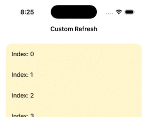

# SwiftUI_CustomPullDownToRefresh

A simple custom pull down to refresh view modifier to be used with ScrollView.
- Custom Indicator view, Custom Threshold, Cancellable

Fore more details, please check out [SwiftUI: Custom Pull Down To Refresh](https://medium.com/@itsuki.enjoy/swiftui-custom-pull-down-to-refresh-7da427dafddd)
